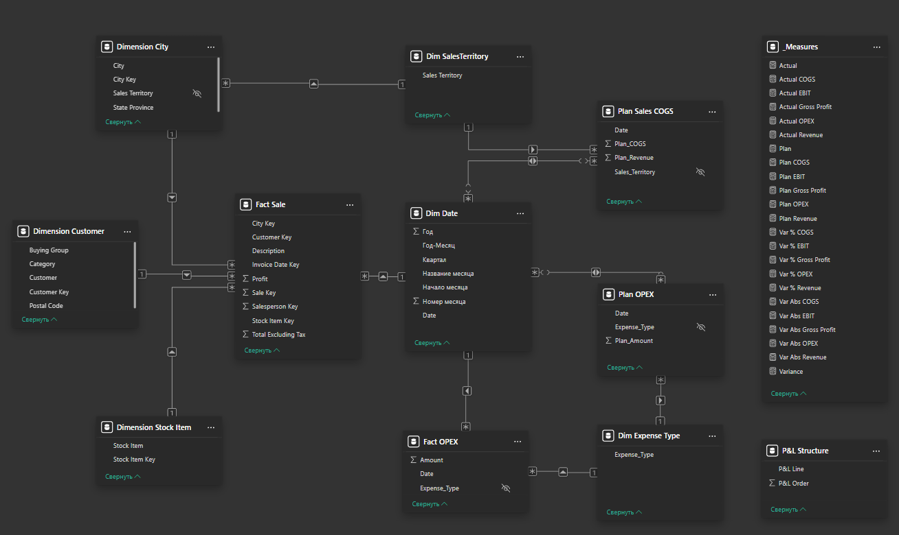

**➡️ [Читать русскую версию (Read in Russian)](./README_RU.md)**

---

📊 Financial Performance and P\&L (Profit \& Loss) Report

🌟 Project Overview

This project provides a Power BI solution for analyzing the financial efficiency (P\&L) of a company. The model enables Actual vs. Plan analysis across key indicators: Revenue, COGS (Cost of Goods Sold), Gross Profit, and EBIT (Earnings Before Interest and Taxes).

🚀 Key Features

Actual vs. Plan Analysis: Variance metrics (absolute and percentage) for all key financial lines.

Performance Optimization: Utilization of Query Folding for large fact tables (Fact Sale, Dimension tables), ensuring efficient data loading from the SQL Server.

Flexible Modeling: Implementation of a Star Schema and a dedicated DAX wrapper table (P\&L Structure) for dynamic P\&L visualization in a matrix.

Data Cleansing: M-Code transformations to align dates to the start of the month for accurate aggregation and calendar mapping.

🛠 Technology and Architecture

Tool / Technology

Purpose

Power BI Desktop

Creating visualizations and the data model.

DAX

Calculating financial metrics (profit, variance) and wrapper measures.

Power Query (M-Code)

Data transformation, cleansing, and setting up relative paths.

SQL Server

Source for actual data (Fact Sale and Dimension tables).

Excel

Source for plan data (Financials.xlsx).

🔍 Data Loading Optimization

Fact Table Optimization: Query Folding is used for Fact Sale and Dimension tables. All filtering and column selection are executed on the SQL Server level, minimizing traffic and load on Power BI.

Period Filtering: Data loading in M-Code (Fact\_Sale.m) is restricted to a specific period, which accelerates model refresh and reduces file size.

📂 Project Structure

/PowerBI-PnL-Analysis

├── Fin\_Analysis.pbix           // Power BI Report File

├── Financials.xlsx             // Source Excel File (Plan Data)

├── README.md                   // This file (English Version)

├── README\_RU.md                // This file (Russian Version)

├── /DAX

│   └── \_Measures.dax           // All DAX measures (including P\&L wrappers)

└── /M-Code

    ├── Fact\_Sale.m             // M-Code with Query Folding and Date Filter

    ├── Plan\_Sales\_COGS.m       // M-Code with Relative Path

    └── ... (other M-files)

⚙️ Setup and Refresh Instructions

To successfully refresh the model:

Download the repository. Place all files into one root folder.

SQL Server Preparation: To refresh the actual data, you must deploy the WideWorldImportersDW database on your local SQL Server.

M-Code Update: Open the M-Code files (Fact\_Sale.m and Fact\_OPEX.m) and replace the placeholder "YOUR\_SQL\_SERVER\_NAME" with the name of your server.

Refresh Data: Open Fin\_Analysis.pbix and click "Refresh".

