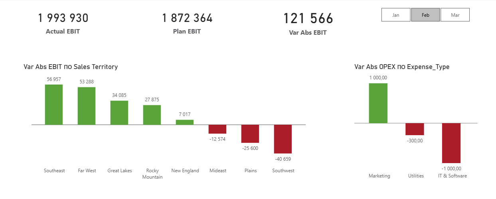
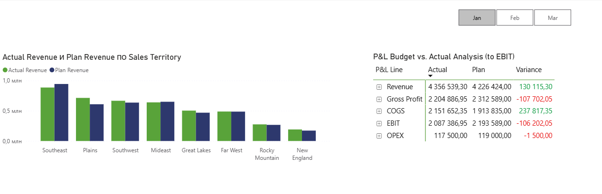

**[English version: README.md](./README.md)**

--

📊 Финансовый Анализ и Отчет P\&L (Profit \& Loss)

🌟 Краткое описание проекта

Этот проект представляет собой решение Power BI для анализа финансовой эффективности (P\&L) компании. Модель позволяет проводить план-факт анализ (Actual vs. Plan) по ключевым показателям: Выручка, Себестоимость (COGS), Валовая прибыль (Gross Profit) и EBIT (Операционная прибыль).

🚀 Основные характеристики

План-факт анализ: Метрики отклонений (абсолютное и процентное) для всех ключевых финансовых строк.

Оптимизация производительности: Использование Query Folding для таблиц фактов (Fact Sale, Dimension tables), что обеспечивает эффективную загрузку данных из SQL Server.

Гибкое моделирование: Реализация Звездной схемы (Star Schema) и специальной таблицы-обертки DAX (P\&L Structure) для динамической визуализации P\&L в матрице.

Очистка данных: Преобразование дат к началу месяца в M-коде для корректной агрегации и сопоставления.

🛠 Технологии и Архитектура

Инструмент / Технология

Назначение

Power BI Desktop

Создание визуализаций и модели данных.

DAX

Расчет финансовых метрик (прибыль, отклонения) и меры-обертки.

Power Query (M-Code)

Трансформация, очистка данных, установка относительных путей.

SQL Server

Источник фактических данных (таблицы Fact Sale, справочники).

Excel

Источник плановых данных (Financials.xlsx).

🔍 Оптимизация загрузки данных

Fact Table Optimization: Для таблиц Fact Sale и Dimension используется Query Folding. Все фильтрации и выбор колонок выполняются на уровне SQL-сервера, минимизируя трафик и нагрузку на Power bi.

Фильтрация по периоду: Загрузка данных в M-коде (Fact\_Sale.m) ограничена определенным периодом , что ускоряет обновление модели и уменьшает размер файла.

!\[Data Model Star Schema](./03_Data_Model_Star_Schema.png)

📂 Структура проекта

/PowerBI-PnL-Analysis

├── Fin\_Analysis.pbix           // Файл отчета Power BI

├── Financials.xlsx             // Исходный файл плана (Excel)

├── README.md                   // Этот файл (Английская версия)

├── README\_RU.md                // Этот файл (Русская версия)

├── /DAX

│   └── \_Measures.dax           // Все DAX-меры (включая обертки P\&L)

└── /M-Code

    ├── Fact\_Sale.m             // M-код с Query Folding и фильтрацией по дате

    ├── Plan\_Sales\_COGS.m       // M-код с относительным путем

    └── ... (остальные M-файлы)

./

./

./

⚙️ Инструкция по запуску и обновлению

Чтобы успешно обновить модель:

Скачайте репозиторий. Поместите все файлы в одну корневую папку.

Подготовка SQL Server: Для обновления фактических данных необходимо развернуть базу данных WideWorldImportersDW на вашем локальном SQL Server.

M-Code Update: Откройте M-коды (Fact\_Sale.m и Fact\_OPEX.m) и замените placeholder "YOUR\_SQL\_SERVER\_NAME" на имя вашего сервера.

Обновление данных: Откройте Fin\_Analysis.pbix и нажмите "Обновить".

